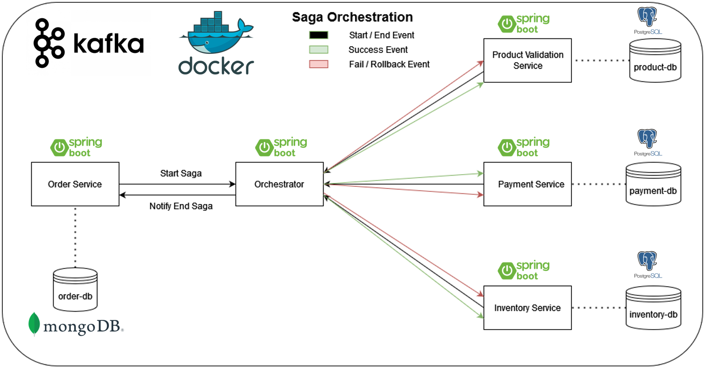

# Microservices Architecture: Orchestrated Saga Pattern
## Summary
- <a href="#Architecture">Architecture
- <a href="#Technologies">Technologies
- <a href="#Tools used">Tools used

## Architecture

<b>Order-Service:</b> microservice responsible only for generating an initial order and receiving a notification. Here we will have REST endpoints to start the process and retrieve event data. The database used will be MongoDB.

<b>Orchestrator-Service:</b> microservice responsible for orchestrating the entire Saga execution flow, it will know which microservice was executed and in which state, and which will be the next microservice to be sent, this microservice will also save the process from events. This service does not have a database.

<b>Product-Validation-Service:</b> microservice responsible for validating whether the product specified in the order exists and is valid. This microservice will store a product validation for an order ID. The database used will be PostgreSQL.

<b>Payment-Service:</b> microservice responsible for making a payment based on the unit values and quantities informed in the order. This microservice will store the payment information for an order. The database used will be PostgreSQL.

<b>Inventory-Service:</b> microservice responsible for downloading the stock of products from an order. This microservice will store the download information of a product for an order ID. The database used will be PostgreSQL.

## Technologies
* Java 17
* Spring Boot 3
* Apache Kafka
* API REST
* PostgreSQL
* MongoDB
* Docker
* docker-compose
* Redpanda Console

## Tools used
* IntelliJ IDEA Community Edition
* Docker
* Gradle
